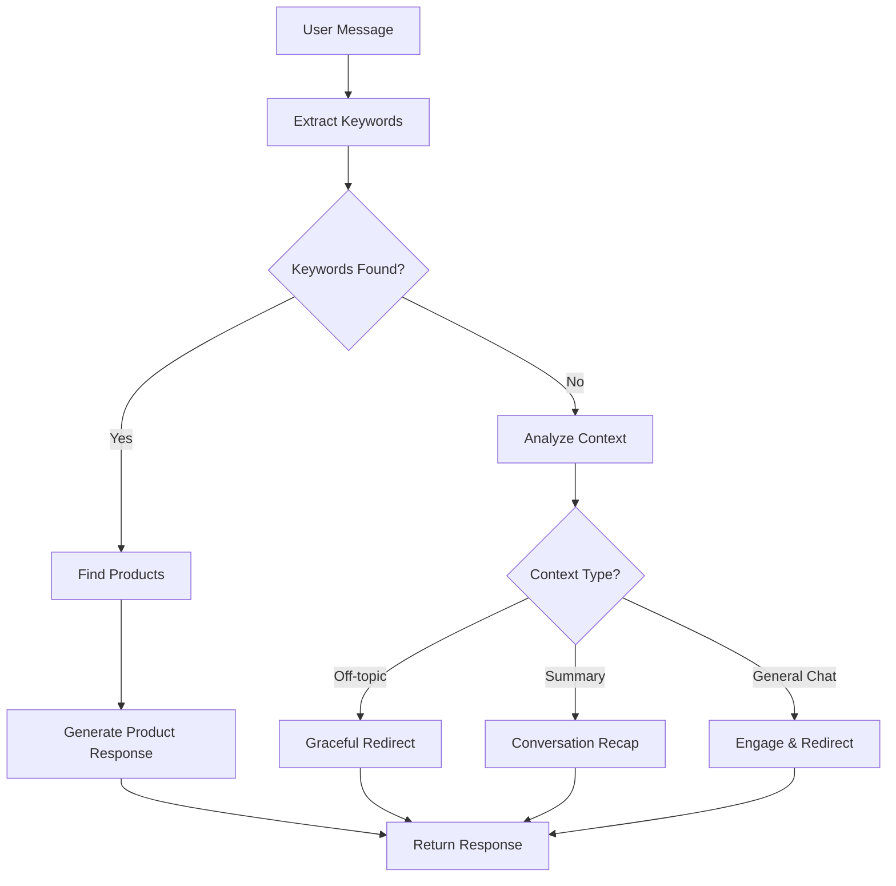

# Enhanced Conversation System - Technical Documentation

## Overview

This document describes the advanced prompting techniques and improvements implemented to make our AI sales agent more human-like while maintaining sales effectiveness.

## Problem Statement

The original system had several limitations:
- **Repetitive responses** when users went off-topic
- **Robotic behavior** when no product keywords were found
- **Poor handling** of conversation context requests
- **Inability to gracefully redirect** off-topic conversations
- **Lack of human-like acknowledgment** of user inputs

## Solution: Advanced Prompting Architecture

### 1. Multi-Layered Response Generation

The new system uses a sophisticated conversation analysis approach:

```python
# Conversation Context Analysis
context_analysis = {
    "intent": "product_inquiry|off_topic|conversation_summary|purchase_intent|general_chat",
    "is_off_topic": true/false,
    "previously_discussed_products": ["product1", "product2"],
    "user_sentiment": "positive|negative|neutral|frustrated|excited",
    "conversation_stage": "greeting|exploration|consideration|objection_handling|ready_to_buy"
}
```

### 2. Intelligent Keyword Extraction

Enhanced keyword extraction that can detect irrelevant conversations:

```python
# New approach - returns empty list for off-topic
keywords = await ai_service.extract_keywords_with_llm(user_message)
if not keywords:  # Off-topic conversation detected
    # Handle gracefully with context-aware response
```

### 3. Specialized Response Generators

Different response strategies based on conversation context:

#### A. Off-Topic Response Handler
```python
def _generate_off_topic_response(self, user_message, conversation_history, product_info, context):
    """
    1. ACKNOWLEDGE what the user said warmly
    2. Show human-like interest/empathy
    3. Natural transition back to products
    4. Reference previously discussed products if any
    """
```

#### B. Conversation Summary Handler
```python
def _generate_conversation_summary_response(self, conversation_history, product_info, context):
    """
    Handles requests like "what are we talking about?"
    - Summarizes discussion naturally
    - Mentions products discussed
    - Transitions back to helping
    """
```

#### C. General Chat Handler
```python
def _generate_general_chat_response(self, user_message, conversation_history, product_info, context):
    """
    For casual conversations that can connect to beauty/personal care
    - Engage naturally with their comment
    - Find creative connections to products
    - Share relevant tips/expertise
    """
```

## Key Improvements

### 1. Human-like Personality: "Zara"

The AI now has a consistent personality:
- **Name**: Zara (friendly beauty consultant)
- **Traits**: Warm, knowledgeable, humorous, professional
- **Approach**: Genuine interest in helping customers
- **Style**: Conversational, not salesy

### 2. Context-Aware Responses

Before:
```
User: "Tell me what we're talking about"
Old AI: "I'd be happy to help you find the perfect fragrance! Based on what you're looking for, I recommend our Wild Stone Code Platinum Perfume..."
```

After:
```
User: "Tell me what we're talking about"
New AI: "Of course! We were discussing fragrances - specifically, I was telling you about our Wild Stone Code Platinum Perfume and how it might be perfect for special occasions. I was about to ask if you'd like to know more about its scent profile or if you're interested in exploring other fragrance options. What would you prefer to focus on?"
```

### 3. Graceful Off-Topic Handling

Before:
```
User: "The weather is nice today"
Old AI: [Same product recommendation as before]
```

After:
```
User: "The weather is nice today"
New AI: "It really is! Beautiful weather always puts me in a good mood. Speaking of feeling good, we were just discussing that wonderful Wild Stone perfume - the kind of fragrance that's perfect for enjoying a lovely day like this. Would you like to hear more about its fresh, appealing scent?"
```

### 4. Adaptive Temperature Settings

Different response types use optimized temperature settings:
- **Product-focused**: 0.7 (balanced creativity/consistency)
- **Off-topic handling**: 0.8 (more creative/human-like)
- **Purchase-ready**: 0.6 (more focused/professional)
- **Analysis tasks**: 0.2 (consistent/accurate)

### 5. Enhanced Prompting Techniques

#### Persona-Based Prompting
```python
system_prompt = f"""You are Zara, a friendly and knowledgeable beauty consultant...
PERSONALITY TRAITS:
- Warm, approachable, and genuinely helpful
- Enthusiastic about beauty and personal care
- Professional yet conversational
- Has a subtle sense of humor
- Genuinely cares about finding the right products
```

#### Context-Injection Prompting
```python
CUSTOMER CONTEXT:
- Conversation stage: {stage}
- Current sentiment: {sentiment}
- Previously discussed: {products}
- Intent: {intent_type}
```

#### Instruction-Following Prompting
```python
RESPONSE STRATEGY:
1. ACKNOWLEDGE their message warmly and appropriately
2. Show you're human and relatable
3. Use natural transition to redirect to beauty/personal care
4. Reference previous products if relevant
5. Keep it light, friendly, and natural
```

## Technical Implementation

### File Structure Changes

1. **ai_service.py**:
   - Added `analyze_conversation_context()`
   - Enhanced `extract_keywords_with_llm()` with off-topic detection
   - Specialized response generators for each context type
   - Improved error handling and fallbacks

2. **conversation_service.py**:
   - Enhanced product info building for empty results
   - Better logging for off-topic conversations
   - Improved keyword handling logic

### API Flow Enhancement



## Usage Examples

### Testing the Enhanced System

```bash
# Run the enhanced conversation test
python test_enhanced_conversation.py
```

### API Integration (No Changes Required)

The existing webhook API remains the same:

```python
POST /api/webhook
{
    "sender": "user_id",
    "recipient": "page_id", 
    "text": "user_message"
}
```

Response format unchanged:
```python
{
    "sender": "user_id",
    "product_interested": "Product Name or null",
    "response_text": "Enhanced AI response",
    "is_ready": false
}
```

## Benefits

### 1. User Experience
- ✅ Natural, human-like conversations
- ✅ Proper acknowledgment of user inputs
- ✅ Graceful handling of off-topic discussions
- ✅ Consistent personality and expertise

### 2. Sales Effectiveness
- ✅ Maintains product focus while being natural
- ✅ Better conversation flow and engagement
- ✅ Reduced user frustration from robotic responses
- ✅ Improved conversion through better rapport

### 3. Technical Robustness
- ✅ Better error handling and fallbacks
- ✅ Context-aware response generation
- ✅ Scalable conversation analysis
- ✅ Backwards compatibility maintained

## Monitoring and Analytics

New logging capabilities:
```python
# Track conversation patterns
self.logger.info("No relevant keywords extracted - conversation may be off-topic")
self.logger.info(f"Context analysis: {context_analysis}")
self.logger.info(f"Response strategy: {response_type}")
```

## Future Enhancements

Potential improvements:
1. **Conversation Memory**: Remember user preferences across sessions
2. **Sentiment Analysis**: Adjust tone based on user mood
3. **Product Learning**: Learn from successful conversations
4. **Multi-language Support**: Handle different languages naturally
5. **Voice Tone Adaptation**: Match user's communication style

---

This enhanced system transforms our AI from a rigid product-pusher into a genuinely helpful beauty consultant that customers will enjoy talking to while still achieving our sales objectives.
